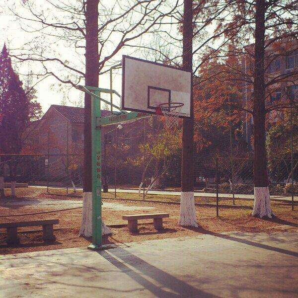

## Welcome to My GitHub

Today I am beginning to write my poor research road of nlp in github.Rookie as I am in this field,there're so much knowlege to be learned. 
I will be here every day to share the reading of the article and encountered engineering difficulties

Soochow University

### Introduction
  I am a postgraduate student in soochow university,and this is my first year in this school.Before coming this city,I studied in Nanjing University of Post and telecomnications,which is also a good school in China.Welcome to  my school and I will take you to visit the beauty.

### Support or Contact

If you are interested in my research or want to advice me on it, please contact me on *cnsr27@gmail.com*, I am very willing to make friends with everyone!

